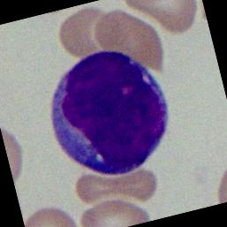
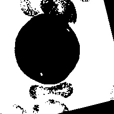

Curso de Especialização de Inteligência Artificial Aplicada

Setor de Educação Profissional e Tecnológica - SEPT

Universidade Federal do Paraná - UFPR

**IAA011 - 2020 - Visão Computacional**
Prof. Lucas Ferrari de Oliveira

---

Descrição do Trabalho
O arquivo trabalho.zip possui imagens de leucócitos na parte central. As imagens são nomeadas como "ImXXX_Y_Z.jpg". Onde ImXXX é o número da imagem, Y é o seu número da sequência de alteração (data augmentation) e Z a sua classe (0 ou 1). Onde, 0 indica paciente normal e 1 pacientes com leucemia.

Utilizando técnicas de Visão Computacional e/ou CNNS extraia características das imagens e faça a sua correta classificação (0 ou 1). Lembre-se de separar os grupos de treinamento e teste. Você pode utilizar a técnica de k-folds para a divisão das imagens e evitar o overfitting.

Entregue um arquivo zip com um relatório do seu trabalho, o(s) código(s) fonte(s) e um README indicando como o seu trabalho funciona. Você pode fazer no Colab e disponibilizar o arquivo fonte.

---
## Pré-processamento de imagem
O módulo data.py é responsável pela extração, transformação e separação das imagens
entre Train, Val e Test.

    1. Extração do arquivo data.zip
    2. Separação dos dados em: Train, Val e Test. Seguindo o racional de 0.7, 0.15 e 0.15
    3. Processamento da imagem
        3.1. Corta 30pixel de cada lado
        3.2.  Converte para BGR e escala de cinza (BGR2GRAY)
        3.3. Aplica o Trehshold binário

**Imagem original**

**Imagem processada**

---

## Execução
O projeto foi desenvolvido para rodar através do Google Colab e localmente.

### Google Colab: 

### Local: todo

## Autor
- Brunno Oliveira - [brunno.oliveira@ufpr.br](mailto:brunno.oliveira@ufpr.br)